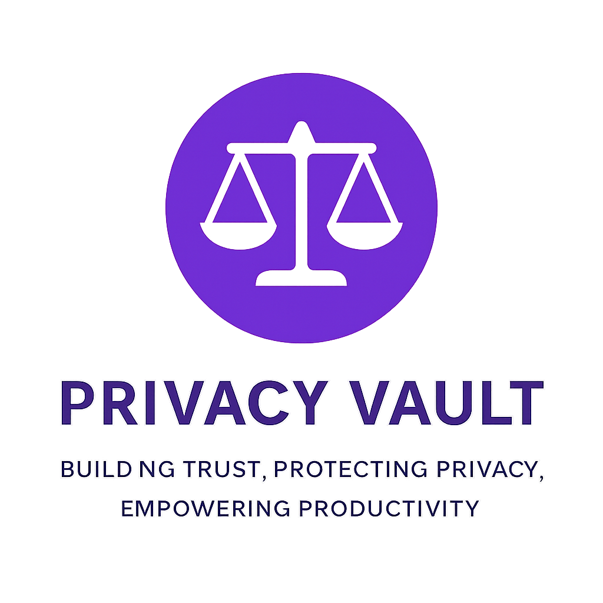

 
# ⚡ Privacy Vault

  

## 🌐 About
**Privacy Vault** is a cyber-dark themed project built to promote trust, protect privacy, and empower productivity.  
It features a neon visual identity, professional UI, and lightweight front-end structure — ideal for secure app branding.

## 🚀 Features
- Futuristic dark theme (Orbitron + neon green)
- Animated glow logo & responsive design
- GitHub Pages ready
- Clean and minimal codebase

## 🛠️ Tech Stack
- HTML5 / CSS3
- Orbitron Font (Google Fonts)
- GitHub Pages Deployment

## 📄 License
This project is licensed under the MIT License.
